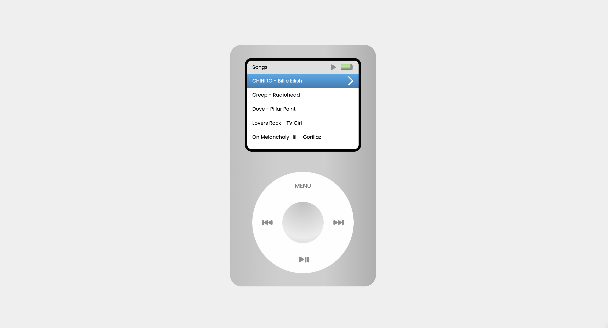

<h1 align="center">🎧 iPod Player</h1>
<p align="center">Reprodução de músicas com visual retrô inspirado no clássico iPod.</p>

<p align="center">
  🔗 <a href="http://ipobre.codaki.com.br" target="_blank"><strong>Visualizar projeto</strong></a>
</p>

---

<p align="center">
  <a href="#-tecnologias-utilizadas">Tecnologias</a>&nbsp;&nbsp;&nbsp;|&nbsp;&nbsp;&nbsp;
  <a href="#-demonstração">Demonstração</a>&nbsp;&nbsp;&nbsp;|&nbsp;&nbsp;&nbsp;
  <a href="#-instalação">Instalação</a>&nbsp;&nbsp;&nbsp;|&nbsp;&nbsp;&nbsp;
  <a href="#-licença">Licença</a>&nbsp;&nbsp;&nbsp;|&nbsp;&nbsp;&nbsp;
  <a href="#-autor">Autor</a>
</p>

---

## 🚀 Tecnologias utilizadas

- [React](https://react.dev)
- [Vite](https://vite.dev)
- [Tailwindcss](https://tailwindcss.com/)

---

## 📸 Demonstração



---

## 🧰 Instalação

```bash
# Clone o repositório
git clone https://github.com/brendamatias/ipobre.git

# Acesse a pasta do projeto
cd ipobre

# Instale as dependências
npm install

# Rode o projeto localmente
npm run dev
```

---

## 🙋‍♀️ Como contribuir

1. Faça um fork do repositório
2. Crie uma branch: `git checkout -b minha-feature`
3. Commit suas mudanças: `git commit -m 'feat: Minha nova feature'`
4. Faça push para sua branch: `git push origin minha-feature`
5. Crie um Pull Request

---

## 📄 Licença

Este projeto está sob a licença [MIT](./LICENSE).

---

## ✨ Autor

Feito com 💜 por [Brenda Matias](https://github.com/brendamatias)<br />
[🔗 LinkedIn](https://www.linkedin.com/in/brenda-matias/)
